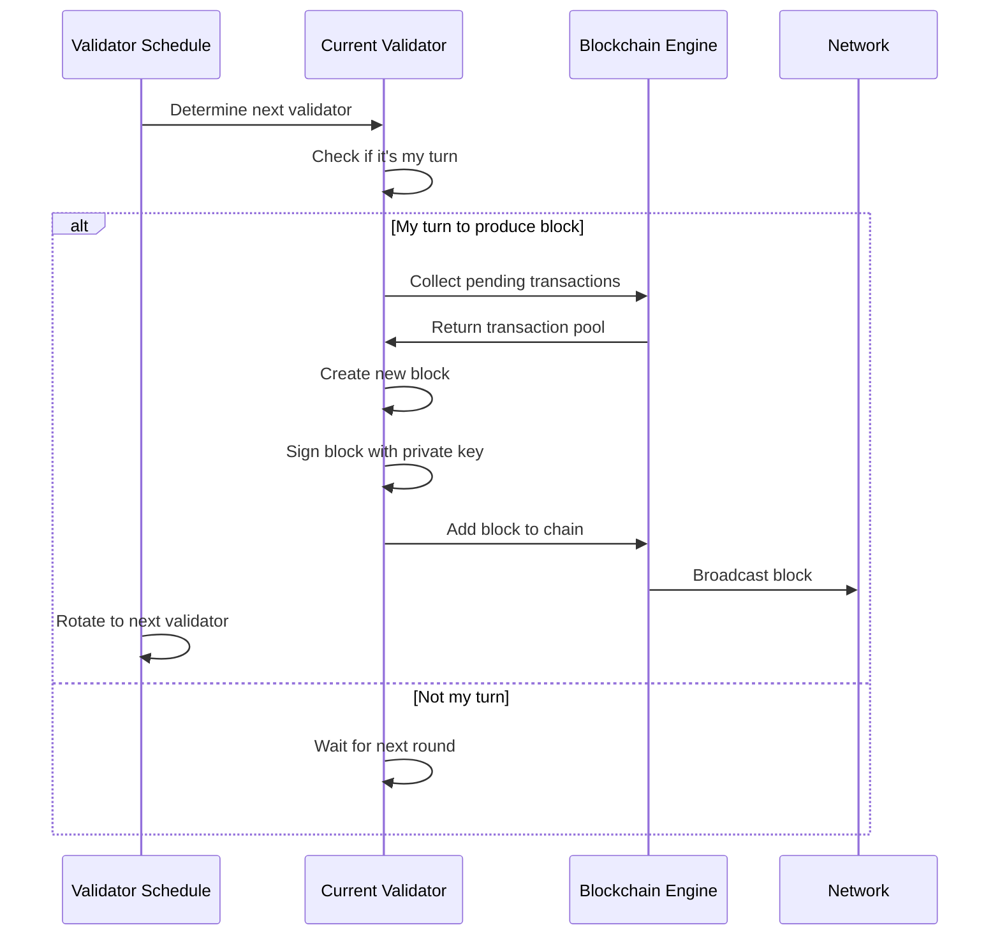

# GridTokenX Proof-of-Authority (PoA) Technical Documentation

## Table of Contents
- [Overview](#overview)
- [Architecture](#architecture)
- [Core Components](#core-components)
- [Consensus Mechanism](#consensus-mechanism)
- [Validator Management](#validator-management)
- [Block Production](#block-production)
- [Security Model](#security-model)
- [Implementation Details](#implementation-details)
- [Configuration](#configuration)
- [API Reference](#api-reference)
- [Testing & Deployment](#testing--deployment)

---

## Overview

GridTokenX implements a **Pure Proof-of-Authority (PoA)** consensus mechanism specifically designed for Thai energy trading blockchain. The system explicitly **disables all mining-based consensus** (PoW, PoS) and operates exclusively through authorized validators representing energy authorities.

### Key Characteristics
- **Mining-Free**: Completely eliminates energy-intensive mining operations
- **Authority-Based**: Only pre-approved energy sector authorities can validate
- **Energy-Focused**: Optimized for energy trading and grid integration
- **Deterministic**: Predictable block production intervals
- **Thailand-Specific**: Designed for Thai energy regulatory framework

### Design Principles
1. **Environmental Sustainability**: Zero mining energy consumption
2. **Regulatory Compliance**: Aligns with Thai energy governance
3. **Performance**: Fast transaction finality (30-second blocks)
4. **Scalability**: Supports Thailand's energy trading volume
5. **Security**: Cryptographic validation by trusted authorities

---

## Architecture

### System Overview
```
┌─────────────────────────────────────────────────────────────────┐
│                    GridTokenX PoA Architecture                    │
├─────────────────────────────────────────────────────────────────┤
│  ┌─────────────────┐  ┌─────────────────┐  ┌─────────────────┐  │
│  │ Thai Energy     │  │ Grid Authority  │  │ Renewable       │  │
│  │ Authority       │  │ Thailand        │  │ Energy Auth     │  │
│  │ (Validator)     │  │ (Validator)     │  │ (Validator)     │  │
│  └─────────────────┘  └─────────────────┘  └─────────────────┘  │
│           │                     │                     │          │
│           └─────────────────────┼─────────────────────┘          │
│                                 │                                │
│  ┌─────────────────────────────────────────────────────────────┐  │
│  │              Consensus Engine (PoA Only)                   │  │
│  │  ┌─────────────┐ ┌─────────────┐ ┌─────────────────────┐  │  │
│  │  │ Validator   │ │ Block       │ │ Authority           │  │  │
│  │  │ Schedule    │ │ Production  │ │ Management          │  │  │
│  │  └─────────────┘ └─────────────┘ └─────────────────────┘  │  │
│  └─────────────────────────────────────────────────────────────┘  │
│                                 │                                │
│  ┌─────────────────────────────────────────────────────────────┐  │
│  │                 Blockchain State                            │  │
│  │  ┌─────────────┐ ┌─────────────┐ ┌─────────────────────┐  │  │
│  │  │ Energy      │ │ Transaction │ │ Balance             │  │  │
│  │  │ Blocks      │ │ Pool        │ │ Management          │  │  │
│  │  └─────────────┘ └─────────────┘ └─────────────────────┘  │  │
│  └─────────────────────────────────────────────────────────────┘  │
└─────────────────────────────────────────────────────────────────┘
```

---

## Core Components

### 1. ConsensusEngine

The central component managing PoA consensus operations.

```rust
pub struct ConsensusEngine {
    config: BlockchainConfig,
    blockchain_state: Arc<RwLock<BlockchainState>>,
    validators: Arc<RwLock<HashSet<AccountId>>>,
    current_validator: Arc<RwLock<Option<AccountId>>>,
    validator_schedule: Arc<RwLock<ValidatorSchedule>>,
    is_producing: Arc<RwLock<bool>>,
}
```

**Key Features:**
- **PoA-Only Validation**: Enforces exclusive PoA usage
- **Thread-Safe**: Uses `Arc<RwLock<>>` for concurrent access
- **Validator Management**: Maintains authorized validator set
- **Block Production**: Coordinates validator rotation
- **State Management**: Tracks blockchain state changes

### 2. Authority Structure

Represents authorized validators in the energy sector.

```rust
pub struct Authority {
    pub account_id: AccountId,
    pub name: String,
    pub expertise: Vec<EnergySource>,
    pub reputation: f64,
    pub authorized_regions: Vec<String>,
    pub public_key: Vec<u8>,
    pub is_active: bool,
    pub registered_at: u64,
}
```

**Authority Types:**
- **ThaiEnergyAuthority**: Primary energy regulator
- **GridAuthorityThailand**: Grid operation authority
- **RenewableEnergyAuth**: Renewable energy specialist
- **Regional Authorities**: Province-specific validators

### 3. ValidatorSchedule

Manages validator rotation and block production timing.

```rust
pub struct ValidatorSchedule {
    pub active_validators: Vec<AccountId>,
    pub round: u64,
    pub current_validator_index: usize,
    pub block_interval: u64,
    pub last_block_time: u64,
}
```

**Scheduling Algorithm:**
1. **Round-Robin**: Validators take turns in predefined order
2. **Time-Based**: Fixed block intervals (configurable, default 30s)
3. **Deterministic**: Predictable validator sequence
4. **Fault-Tolerant**: Continues if validator is offline

### 4. EnergyBlock Structure

Energy-optimized block format for trading data.

```rust
pub struct EnergyBlock {
    pub header: BlockHeader,
    pub transactions: Vec<EnergyTransactionEnvelope>,
    pub energy_stats: EnergyBlockStats,
    pub validator_signature: ValidatorSignature,
}
```

**Block Components:**
- **Header**: Standard blockchain metadata
- **Transactions**: Energy trading transactions
- **Energy Stats**: Aggregated energy data
- **Validator Signature**: PoA authentication

---

## Consensus Mechanism

### PoA Consensus Flow



### Consensus Rules

1. **Authority Verification**: Only authorized validators can produce blocks
2. **Sequential Production**: Validators produce blocks in predetermined order
3. **Time Constraints**: Blocks must be produced within time windows
4. **Signature Validation**: All blocks must be cryptographically signed
5. **No Mining**: Completely eliminates computational puzzles

### Finality Model

- **Immediate Finality**: Blocks are final once signed by authorized validator
- **No Reorganization**: Chain history cannot be altered
- **Deterministic**: Transaction order is predictable
- **Fast Settlement**: Transactions confirm in ~30 seconds

---

## Validator Management

### Initial Validator Set

The system initializes with three primary Thai energy authorities:

```rust
// Default validators for Thai energy sector
let energy_authority = AccountId::from_str("ThaiEnergyAuthority");
let grid_authority = AccountId::from_str("GridAuthorityThailand");
let renewable_authority = AccountId::from_str("RenewableEnergyAuth");
```

### Validator Lifecycle

#### 1. Registration
```rust
pub async fn add_validator(
    &self, 
    validator_id: AccountId, 
    authority: Authority
) -> SystemResult<()>
```

#### 2. Activation
- Authority verification
- Cryptographic key validation
- Region/expertise authorization
- Network consensus (governance)

#### 3. Operation
- Block production rotation
- Transaction validation
- Network participation
- Reputation maintenance

#### 4. Deactivation
```rust
pub async fn remove_validator(
    &self, 
    validator_id: &AccountId
) -> SystemResult<()>
```

### Authority Permissions

| Authority Type | Energy Sources | Regions | Special Powers |
|----------------|----------------|---------|----------------|
| Thai Energy Authority | All | National | Governance, Emergency |
| Grid Authority Thailand | All | National | Grid Operations |
| Renewable Energy Auth | Solar, Wind, Hydro | National | Green Energy |
| Regional Authorities | Regional Mix | Specific Provinces | Local Trading |

---

## Block Production

### Production Algorithm

```rust
async fn produce_block_static(
    blockchain_state: &Arc<RwLock<BlockchainState>>,
    validator_schedule: &Arc<RwLock<ValidatorSchedule>>,
    validator_id: AccountId,
) -> SystemResult<()>
```

### Block Production Steps

1. **Validator Check**: Verify it's the designated validator's turn
2. **Transaction Collection**: Gather pending transactions from pool
3. **Block Assembly**: Create block with header, transactions, stats
4. **Energy Stats Calculation**: Compute energy trading statistics
5. **Block Signing**: Cryptographically sign block with validator key
6. **Chain Addition**: Add block to blockchain state
7. **Broadcast**: Distribute block to network
8. **Rotation**: Move to next validator in schedule

### Block Validation

```rust
pub fn verify_block_signature(&self, block: &EnergyBlock) -> SystemResult<bool>
```

**Validation Criteria:**
- Validator authority verification
- Signature cryptographic validation
- Timestamp consistency
- Transaction validity
- Energy data integrity

---

## Security Model

### Threat Model

| Threat | Mitigation | Implementation |
|--------|-------------|----------------|
| **Unauthorized Block Production** | Authority-only validation | Cryptographic signatures |
| **Double Spending** | Sequential block production | Deterministic ordering |
| **Network Splits** | Authority consensus | Majority validator agreement |
| **Validator Compromise** | Multi-validator requirement | Authority threshold |
| **DoS Attacks** | Rate limiting | Gas limits, timeouts |

### Cryptographic Security

#### Validator Authentication
- **Ed25519 Signatures**: Each validator signs blocks with private key
- **Public Key Infrastructure**: Validators have verified public keys
- **Account ID Derivation**: AccountIds derived from public keys

```rust
pub struct ValidatorSignature {
    pub validator: AccountId,
    pub signature: Vec<u8>,
    pub timestamp: u64,
}
```

#### Block Integrity
- **SHA256 Hashing**: Block hashes ensure data integrity
- **Merkle Roots**: Transaction integrity verification
- **Chain Linking**: Each block references previous block hash

### Authority Trust Model

1. **Government Backed**: Validators represent official Thai authorities
2. **Multi-Authority**: Requires multiple validators for consensus
3. **Reputation Based**: Validator performance tracking
4. **Governance Controlled**: Authority changes require governance

---

## Implementation Details

### Configuration Requirements

```toml
[blockchain]
consensus_algorithm = "proof_of_authority"  # REQUIRED: Must be PoA
block_time = 30                             # Block interval in seconds
validator_rotation_interval = 1             # Blocks per validator
max_validators = 10                         # Maximum allowed validators
authority_threshold = 3                     # Minimum validators for consensus
```

### Critical Validations

```rust
pub fn validate_poa_only(&self) -> SystemResult<()> {
    if self.config.consensus_algorithm != "proof_of_authority" {
        return Err(SystemError::Configuration(
            "❌ CRITICAL: Only Proof-of-Authority is allowed! PoW and other consensus mechanisms are disabled."
        ));
    }
    Ok(())
}
```

### Performance Characteristics

| Metric | Value | Notes |
|--------|-------|-------|
| **Block Time** | 30 seconds | Configurable, energy trading optimized |
| **Transaction Throughput** | ~100 TPS | Limited by block size, not mining |
| **Finality Time** | ~30 seconds | Single block confirmation |
| **Energy Consumption** | Near zero | No mining operations |
| **Validator Count** | 3-10 typical | Scalable to Thailand's needs |

### Error Handling

```rust
pub enum ConsensusError {
    InvalidValidator(String),
    BlockProductionFailed(String),
    SignatureVerificationFailed(String),
    AuthorityNotFound(String),
    PoAValidationFailed(String),
}
```

---

## Configuration

### System Configuration

```rust
pub struct BlockchainConfig {
    pub network: String,
    pub node_id: String,
    pub validator: bool,
    pub consensus_algorithm: String,
    pub block_time: u64,
    pub validator_rotation_interval: u64,
    pub max_validators: u32,
    pub authority_threshold: u32,
}
```

### Production Configuration Example

```toml
[blockchain]
network = "mainnet"
node_id = "thai-energy-validator-01"
validator = true
consensus_algorithm = "proof_of_authority"
block_time = 30
validator_rotation_interval = 1
max_validators = 7
authority_threshold = 5
gas_limit = 21000000
gas_price = 1000000000

[validator]
private_key_file = "/secure/validator.key"
authority_name = "Thai Energy Authority"
authorized_regions = ["Bangkok", "Central", "Northern", "Northeastern", "Southern"]
expertise = ["Solar", "Wind", "Hydro", "Nuclear", "Natural Gas"]
```

### Development Configuration

```toml
[blockchain]
network = "development"
consensus_algorithm = "proof_of_authority"
block_time = 5  # Faster for testing
max_validators = 3
authority_threshold = 2
```

---

## API Reference

### Consensus Engine API

#### Start Consensus Engine
```rust
pub async fn start(&self) -> SystemResult<()>
```
Starts the PoA consensus engine with validation.

#### Add Validator
```rust
pub async fn add_validator(
    &self, 
    validator_id: AccountId, 
    authority: Authority
) -> SystemResult<()>
```
Adds a new validator to the authority set.

#### Remove Validator
```rust
pub async fn remove_validator(
    &self, 
    validator_id: &AccountId
) -> SystemResult<()>
```
Removes a validator from the authority set.

#### Get Validators
```rust
pub async fn get_validators(&self) -> HashSet<AccountId>
```
Returns the current set of authorized validators.

#### Get Validator Schedule
```rust
pub async fn get_validator_schedule(&self) -> ValidatorSchedule
```
Returns the current validator rotation schedule.

### Authority Management API

#### Create Authority
```rust
pub fn new(
    account_id: AccountId,
    name: String,
    expertise: Vec<EnergySource>,
    authorized_regions: Vec<String>,
    public_key: Vec<u8>,
) -> Self
```

#### Validate Energy Source Authority
```rust
pub fn can_validate_energy_source(&self, energy_source: &EnergySource) -> bool
```

#### Validate Regional Authority
```rust
pub fn can_validate_region(&self, region: &str) -> bool
```

### Block Production API

#### Produce Block
```rust
async fn produce_block_static(
    blockchain_state: &Arc<RwLock<BlockchainState>>,
    validator_schedule: &Arc<RwLock<ValidatorSchedule>>,
    validator_id: AccountId,
) -> SystemResult<()>
```

#### Verify Block Signature
```rust
pub fn verify_block_signature(&self, block: &EnergyBlock) -> SystemResult<bool>
```

---

## Testing & Deployment

### Unit Testing

```rust
#[tokio::test]
async fn test_poa_consensus_initialization() {
    let config = BlockchainConfig {
        consensus_algorithm: "proof_of_authority".to_string(),
        // ... other config
    };
    
    let consensus = ConsensusEngine::new(&config).await.unwrap();
    assert_eq!(consensus.get_consensus_type(), "proof_of_authority");
    assert!(consensus.is_mining_disabled());
}

#[tokio::test]
async fn test_validator_management() {
    // Test validator addition/removal
    // Test authority permissions
    // Test validator rotation
}

#[tokio::test]
async fn test_block_production() {
    // Test block creation
    // Test validator signatures
    // Test block validation
}
```

### Integration Testing

```bash
# Start test network with 3 validators
cargo test --test integration_tests -- test_poa_network

# Test validator rotation
cargo test --test consensus_tests -- test_validator_rotation

# Test authority permissions
cargo test --test authority_tests -- test_regional_validation
```

### Deployment Checklist

#### Pre-Deployment
- [ ] Validate PoA-only configuration
- [ ] Verify validator keys and authorities
- [ ] Test network connectivity
- [ ] Backup genesis block configuration
- [ ] Set up monitoring and alerts

#### Production Deployment
```bash
# Deploy with Docker
docker-compose up -d thai-energy-blockchain

# Verify consensus engine
curl http://localhost:8080/consensus/status

# Check validator set
curl http://localhost:8080/consensus/validators

# Monitor block production
curl http://localhost:8080/blockchain/latest-block
```

#### Post-Deployment
- [ ] Verify block production
- [ ] Monitor validator performance
- [ ] Check transaction processing
- [ ] Validate energy statistics
- [ ] Confirm regulatory compliance

### Monitoring

#### Key Metrics
- **Block Production Rate**: Blocks per minute
- **Validator Performance**: Individual validator statistics
- **Transaction Throughput**: Transactions per second
- **Network Health**: Validator connectivity
- **Energy Statistics**: Trading volume and patterns

#### Alerting
- Validator offline detection
- Block production delays
- Consensus failures
- Authority permission violations
- Network partitioning

---

## Conclusion

GridTokenX's Proof-of-Authority implementation provides a robust, energy-efficient, and Thailand-focused consensus mechanism for energy trading. The pure PoA approach eliminates mining while ensuring regulatory compliance and optimal performance for the Thai energy sector.

### Key Benefits
- **Zero Mining Energy**: Environmentally sustainable
- **Regulatory Aligned**: Matches Thai energy governance
- **High Performance**: Fast transactions and finality
- **Secure**: Authority-based cryptographic validation
- **Scalable**: Supports national energy trading volume

### Future Enhancements
- Dynamic validator reputation system
- Cross-border energy trading support
- Enhanced governance mechanisms
- Real-time energy grid integration
- Automated compliance reporting

---

**Document Version**: 1.0  
**Last Updated**: July 23, 2025  
**Author**: GridTokenX Development Team  
**Review**: Thai Energy Authority Technical Committee
